# Not Plain Calc &mdash; Designing and Shipping a Modern Macintosh-Inspired Calculator

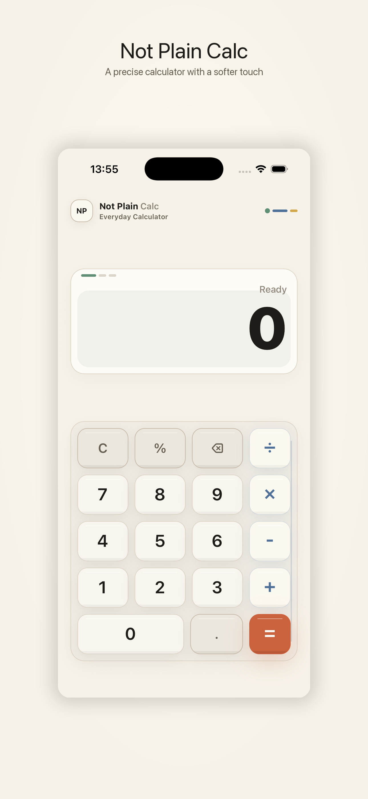

> A product design and React Native engineering case study about turning the most familiar utility on a phone into a small, coherent product. The source, public pages, privacy materials, and store assets are published. The signed iOS build is uploaded to App Store Connect and available through a public TestFlight beta.

| Project | Not Plain Calc v1.0 |
|---|---|
| Roles | Product Designer, iOS Developer, Software Engineer |
| Platform | iPhone, built with Expo and React Native |
| Documented release sprint | June 8 to June 9, 2026 |
| Status | Public GitHub repository; public TestFlight beta live |
| Repository | [github.com/Pitta150507/not-plain-calc](https://github.com/Pitta150507/not-plain-calc) |
| Live product page | [pitta150507.github.io/not-plain-calc](https://pitta150507.github.io/not-plain-calc/) |

This document separates facts preserved in the repository from reconstruction. Public commits, source code, tests, screenshots, and release notes are treated as evidence. When an early screenshot or an exact error log was not retained, the case study says so instead of filling the gap with a cleaner story.

## Contents

1. [Project overview](#1-project-overview)
2. [Problem statement](#2-problem-statement)
3. [Design exploration](#3-design-exploration)
4. [Macintosh Refined](#4-macintosh-refined)
5. [Engineering](#5-engineering)
6. [Debugging stories](#6-debugging-stories)
7. [Product shipping](#7-product-shipping)
8. [Metrics](#8-metrics)
9. [Lessons learned](#9-lessons-learned)
10. [Portfolio summary](#10-portfolio-summary)

---

## 1. Project overview

### What I built

Not Plain Calc is an offline, iPhone-first calculator for everyday arithmetic. It supports addition, subtraction, multiplication, division, percentages, decimals, deletion, clear, chained operations, and result formatting. The interaction model stays close to calculators people already know. The difference is in the treatment: physical-looking keys, a deliberately framed display, restrained haptics, responsive result type, and a visual identity derived from the product itself.

The app has no account, server, database, ads, analytics, or tracking. Every calculation stays on the device. That decision reduced the privacy surface and kept the project focused on interaction quality.

### Why I made it

Calculator apps are a useful design constraint because nobody needs to learn what they do. Any confusion is therefore mine to own. I could not hide weak hierarchy behind onboarding, novelty, or a long feature list.

The project started with a simple dissatisfaction: default calculators are efficient but anonymous, while many styled calculators trade speed for decoration. I wanted a third option. The app should feel personal without asking the user to relearn arithmetic.

### Intended users

The primary user is someone doing short, ordinary calculations on an iPhone: a price adjustment, a percentage, a quick total, or a division. The app is also designed for users who notice visual craft but do not want that craft to slow them down.

That led to a narrow product promise:

- The keypad must be readable at a glance.
- Touch targets must remain comfortably above the iOS minimum.
- The active operation must be visible.
- Long results must stay legible without breaking the layout.
- Motion and haptics must confirm input without becoming a performance.
- The app must work offline and collect no data.

### Project goals

The first goal was behavioral reliability. Calculator state has awkward edges: leading zeroes, repeated decimals, chained operators, division by zero, new input after equals, and values that need exponential notation. A polished interface is not useful if those transitions are vague.

The second goal was product identity. I wanted the interface to be recognizable without a logo pasted on top. This eventually shaped the app icon as well.

The third goal was release discipline. The repository includes tests, strict type checking, EAS configuration, App Store metadata, privacy and support pages, an IP review, and a documented shipping blocker. That Apple credential blocker was later resolved. EAS produced the signed binary, App Store Connect received it, and TestFlight now distributes the public beta.

### Timeline and status

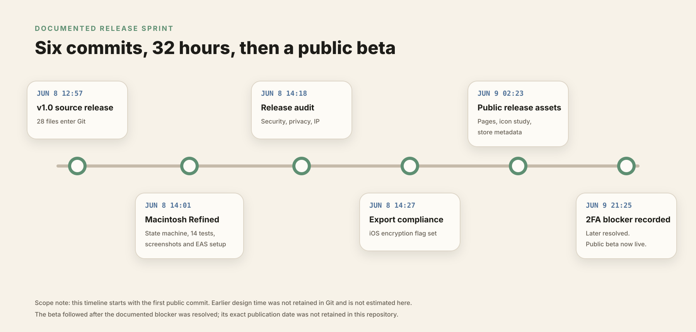

The public Git history begins on June 8, 2026 with the complete v1 source. It does not preserve the full time spent before that first commit, so I do not estimate it. The traceable release sprint lasted 32 hours and 29 minutes across two calendar days:

| Time | Commit | What changed |
|---|---|---|
| Jun 8, 12:57 | `334af8e` | Published the v1.0 source, component system, calculator logic, tokens, and first portfolio notes. |
| Jun 8, 14:01 | `9ea27eb` | Introduced Macintosh Refined, extracted a pure state machine, added 14 tests, EAS configuration, and the screenshot set. |
| Jun 8, 14:18 | `fe178a4` | Added the release, security, privacy, accessibility, dependency, and IP audit. |
| Jun 8, 14:27 | `e1dfeea` | Declared the iOS non-exempt encryption setting. |
| Jun 9, 02:23 | `b2ed796` | Published GitHub Pages, store metadata, icon explorations, support and privacy pages. |
| Jun 9, 21:25 | `8287c54` | Recorded the Apple 2FA credential blocker instead of implying a successful upload. |

The final row records a real blocker at that point in the release. It was later resolved and the app reached public TestFlight beta. The exact beta publication date was not retained in this repository, so the timeline does not invent one.

### Technologies

| Area | Technology |
|---|---|
| App framework | Expo 54, Expo Router 6 |
| UI | React 19, React Native 0.81 |
| Language | TypeScript 5.9 in strict mode |
| Interaction | React Native Reanimated 4, Gesture Handler 2 |
| Native feedback | Expo Haptics |
| State and arithmetic | Pure TypeScript state machine and formatter |
| Testing | Vitest 4 |
| Build and distribution | EAS Build, App Store Connect, public TestFlight beta |
| Public documentation | GitHub Pages |

### Release status

- GitHub: public repository on `main`.
- App version: `1.0.0`, build number `1`.
- Git tags: none. The release version is declared in source and commit history, not represented by a tag.
- Public pages: marketing, privacy, and support URLs are live.
- TestFlight: public beta active.
- App Store Connect: signed iOS build uploaded.
- Apple signing: credentials and provisioning completed after resolving the earlier 2FA blocker.
- Remaining work: beta feedback, final accessibility regression, and a separate production App Store submission.

---

## 2. Problem statement

### Familiar products become invisible

Most people open a calculator, enter a number, and leave. There is almost no discovery phase and little emotional attachment. That makes the category easy to ignore and difficult to design well. The interface has to communicate instantly, but the designer has very little room to change the established pattern.

This was the tension at the center of the project:

> How can a calculator gain a distinct identity while staying as immediate as the calculator already in someone's pocket?

Adding features would have dodged the question. History, graphing, conversion, themes, and widgets can all be useful, but none of them solves the basic interface. For v1, I kept the scope on the act of calculating.

### Utility software still has a character

Utility design is sometimes treated as neutral plumbing. In practice, small decisions influence confidence. A button that moves under a finger feels different from a flat rectangle. An active operator reduces uncertainty during a chained calculation. A result that changes size predictably feels more stable than one that suddenly collapses.

The utility does not need a dramatic personality. It needs a consistent one. Not Plain Calc uses familiar spatial rules and gives them material cues: keys sit on a plate, the display is inset, the operator rail has its own rhythm, and equals is the strongest action.

### Identity in a mature category

The mature-category problem has two bad extremes:

| Extreme | What goes wrong |
|---|---|
| Copy the platform calculator | The app feels redundant and creates legal or brand risk if the resemblance becomes too literal. |
| Reject every convention | The product becomes a visual experiment that is slower to use. |

My working principle became "familiar behavior, original surface." Arithmetic order, labels, and keypad grouping remain conventional. The proportions, material language, color roles, display frame, brand lockup, motion, and icon are original to Not Plain Calc.

---

## 3. Design exploration

### The first public direction

The first public code snapshot used a warmer and softer visual system: a cream background, orange operator emphasis, larger 74-point keys, highly rounded corners, and a glowing result area. It was pleasant, but its identity depended too much on color and softness. Those qualities are common in contemporary utility apps.

No screenshot from that exact build was committed. The comparison below reconstructs its layout from the Git snapshot and labels it accordingly.

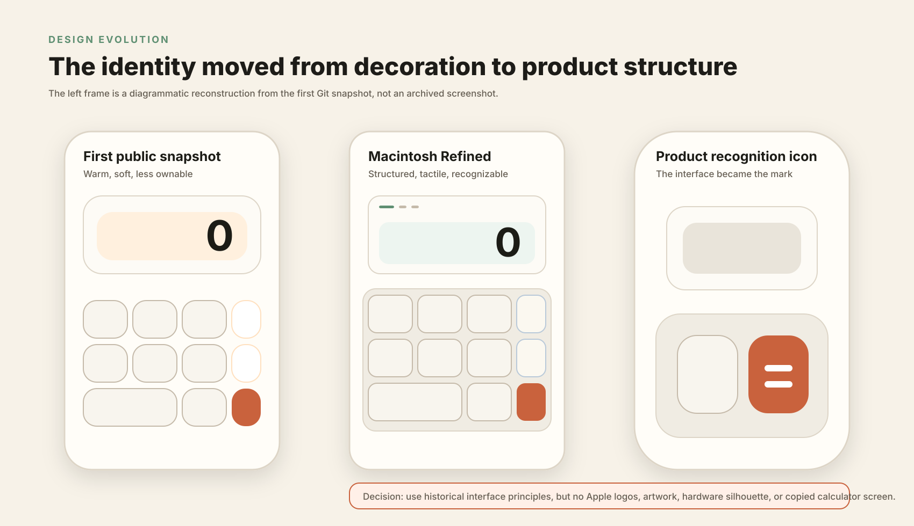

### What the redesign changed

| First public snapshot | Macintosh Refined | Reason |
|---|---|---|
| Warm orange carried most interaction meaning | Blue identifies operators, green identifies selection, coral identifies resolution | Separate colors now have separate jobs. |
| Large rounded keys floated on the canvas | Squarer tactile keys sit inside a keypad plate | Grouping became structural instead of decorative. |
| The display was mainly a glow behind text | The result sits inside a bordered, inset well | The readout gained a stable visual home. |
| A simple wordmark occupied the top bar | A compact NP monogram, product name, subtitle, and signal marks form a lockup | The app gained hierarchy without adding navigation. |
| Result type used very large default sizes | The final scale is slightly tighter and framed by a fixed result region | Long and short values feel more consistent. |
| Softness was the main personality | Material, grouping, and proportion became the personality | The design became more ownable. |

### Macintosh inspiration without imitation

The early Macintosh reference was useful because those interfaces made technical systems feel approachable through clear hierarchy, visible controls, and physical metaphors. I borrowed that philosophy, not a screen.

The final app does not reproduce Macintosh hardware, an old system window, Apple artwork, an Apple logo, or a historical calculator layout. The cream and platinum surfaces, inset readout, compact signal marks, and tactile controls are original arrangements. Public release copy also avoids calling the product a "Macintosh app" or suggesting Apple involvement.

Not Plain Calc is independent and is not affiliated with, endorsed by, or sponsored by Apple Inc.

### Icon exploration

The icon went through three broader directions before the final crop study.

| Direction | Asset | Decision |
|---|---|---|
| Soft Precision | 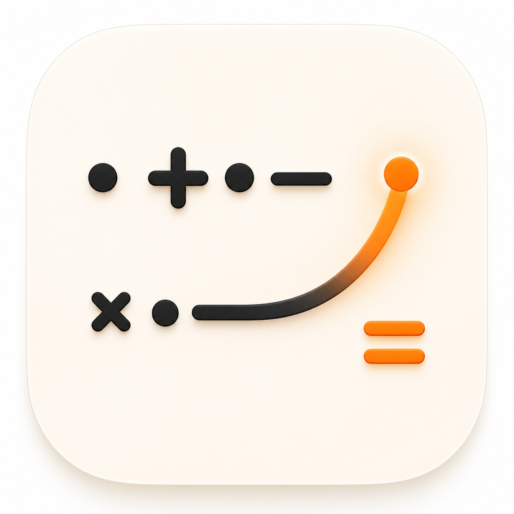 | Polished but disconnected from the final interface. It could belong to many utility products. |
| Abstract public release | 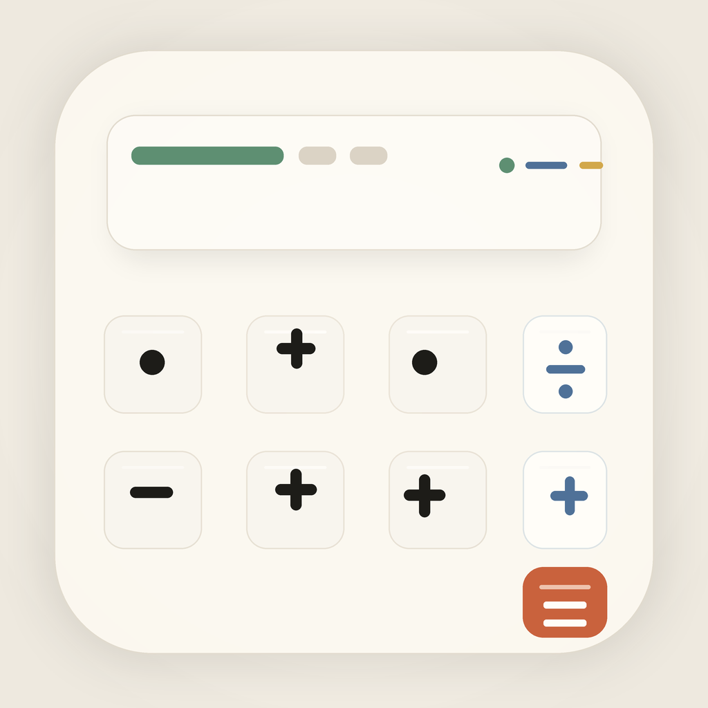 | Cleaner at small sizes, but still too generic to create product recognition. |
| Random keypad | 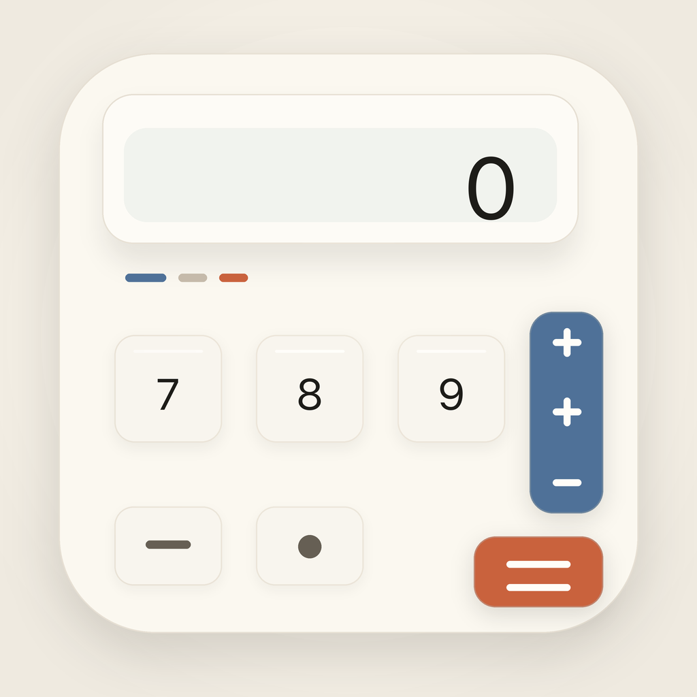 | Closer to the product, but duplicate symbols and invented keys made the layout confusing. |
| Product recognition | 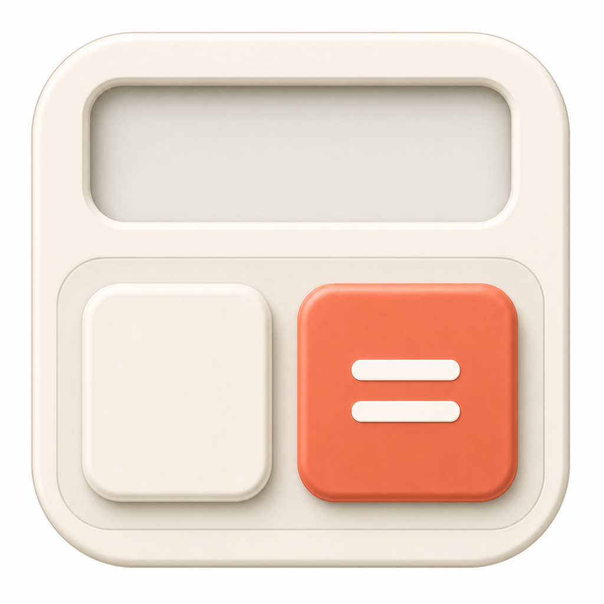 | Uses the app's own display well, keypad plate, physical key geometry, and coral equals key. |

The final pass compared five 180-pixel crops from the same product language:

| A | B | C | D | E, selected |
|---|---|---|---|---|
| 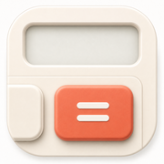 | 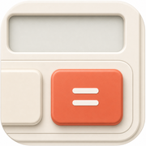 | 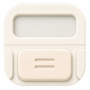 | 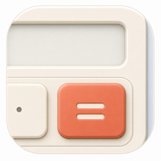 |  |

- Candidate A showed clear keypad structure, but the cropped left key felt unresolved.
- Candidate B was product-specific but visually tight.
- Candidate C proved the neutral geometry worked, though it lost the final-action cue.
- Candidate D introduced a dot that read like a random symbol.
- Candidate E kept the display, plate, blank key, and equals key in a balanced composition. It also held up at 60 by 60 points.

### Failed concepts were useful

The rejected icons revealed a broader product lesson. A mark does not become specific by adding more signs. The random keypad had more calculator content than the final icon, yet communicated less clearly. The winning icon removes numbers and leaves the product's most distinctive relationships.

The same lesson applied to the interface. The redesign did not add more controls. It made grouping and state easier to read.

### What I learned during exploration

1. A familiar category needs a point of view, but convention is still an asset.
2. Material cues work when they explain hierarchy. Shadows without grouping only add noise.
3. Identity is stronger when the app icon and interface share the same geometry.
4. Small-size tests expose false detail quickly. Candidate D looked intentional at full size and arbitrary at icon size.
5. Legal restraint improved the design. Avoiding literal Apple references forced the product to find its own visual grammar.

---

## 4. Macintosh Refined

### Why this direction won

Macintosh Refined answered the three product requirements at once. It remained legible as a calculator, felt tactile without becoming a toy, and had enough structural identity to support an icon and portfolio story.

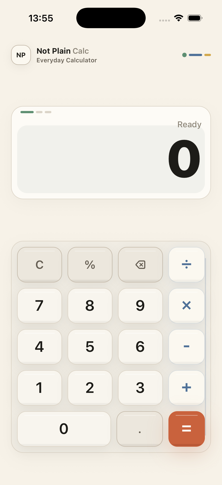

### Tactile UI philosophy

Each key has a surface, border, top light, bottom shade, and shadow wrapper. On press, Reanimated changes scale and vertical depth with a spring. The equals key moves slightly more than a number key because it closes the current operation. Haptics use matching categories for numbers, utilities, operators, and equals.

The feedback is intentionally short. The motion tokens range from 120 to 260 milliseconds, and the spring values are centralized. Reduced Motion disables the physical displacement rather than leaving accessibility as a later concern.

### Material language

The screen is built from three layers:

- A warm background acts as the body of the object.
- The result well and keypad plate create inset and grouped regions.
- Individual keys sit above the plate, with operators receiving a cooler blue material and equals receiving coral.

The shadows are low-opacity and role-based. A number key, operator, active operator, and equals key have different depth values, but they all use the same lighting direction.

### Layout hierarchy

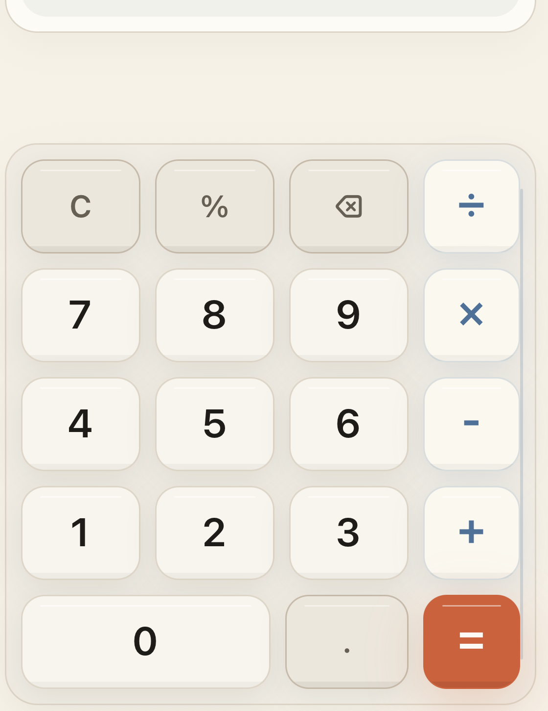

The vertical hierarchy is simple:

1. The top bar names the product and provides a small signal motif.
2. The result well gets flexible space and stays near the visual center.
3. The keypad plate anchors the lower screen.

Within the keypad, the numeric island expands while the operator rail keeps a fixed width. This protects alignment across screen sizes. A compact mode activates below 700 points in height or 360 points in width, reducing key height, rail width, gaps, padding, and display height together.

### Calculator ergonomics

- Standard keys are 64 points high with a 54-point minimum dimension.
- Compact keys are 52 points high with a 50-point minimum height.
- The zero key spans two numeric columns while the decimal stays in the third.
- Operators remain in a dedicated right rail.
- Equals occupies the last rail position and uses the strongest visual color.
- Utility functions sit above the digits, separated by tone rather than distance.

The touch targets exceed Apple's 44-point guideline in both layouts. The interface is portrait-only for v1, which makes the keypad geometry predictable and matches the intended quick-use context.

### Interaction decisions

| Decision | Product reason | Implementation |
|---|---|---|
| Show the expression above the result | Users can verify what is being resolved. | The state machine preserves a readable expression string. |
| Show the active operator | Chained calculations otherwise become ambiguous. | The selected key changes border, label, inset glow, shadow, and accessibility state. |
| Animate only press and resolution | Constant motion would compete with numeric reading. | Spring press states and one restrained result response. |
| Start fresh after equals | This matches common calculator expectations. | `waitingForOperand` controls replacement instead of appending. |
| Cap direct input at ten digits | Prevents unusable in-progress strings. | `MAX_INPUT_DIGITS` is enforced before rendering. |
| Use exponential notation when needed | Very large values still need a stable representation. | Results switch to five-digit exponential formatting outside the readable range. |

### Component breakdown

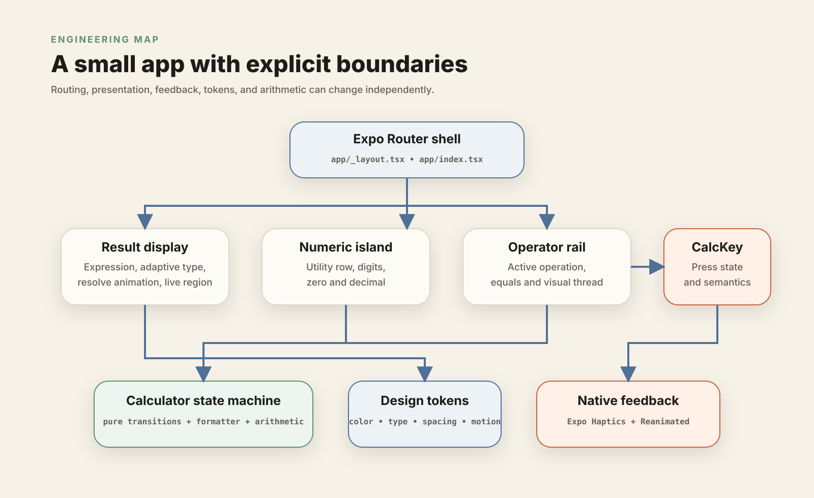

The visible screen is composed from five calculator components:

- `CalculatorScreen` coordinates layout, haptics, and state-machine actions.
- `ResultDisplay` owns expression and result presentation.
- `NumericIsland` describes the utility and digit rows.
- `OperatorRail` describes the four operations and equals.
- `CalcKey` provides a single accessible, animated control primitive.

That structure prevents one-off key styling. Every control receives the same state handling, press feedback, type behavior, and accessibility role.

### Spacing system

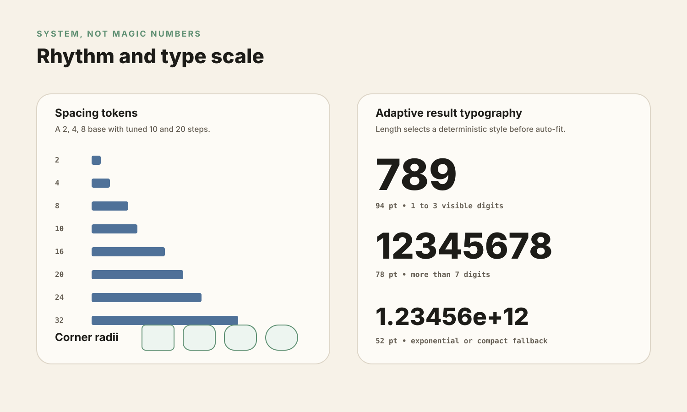

The spacing tokens are `0, 2, 4, 8, 10, 16, 20, 24, 32, 40`, plus a 28-point display gap retained for specific composition needs. Most component relationships sit on a 4 or 8-point rhythm. Ten points is used where the visual density of keys needed a smaller step than 16.

Radius tokens range from 8 to 28 points, plus a pill value. The final interface reduced the first design's corner radii. Keys now read as physical rectangles rather than soft capsules.

### Typography

The app uses the system typeface and tabular numbers. This avoids font loading, matches iOS rendering, and prevents digits from shifting horizontally as values change.

Result type is selected by visible length:

| Content | Standard size | Compact behavior |
|---|---:|---|
| 1 to 3 visible digits | 94 pt | Uses the 88 pt result style |
| 4 to 7 digits | 88 pt | Uses the 78 pt medium style |
| 8 to 11 digits | 78 pt | Uses the 64 pt compact style |
| Exponential, undefined, or longer | 64 pt | Uses the 52 pt tiny style |

`adjustsFontSizeToFit` remains as a final safety layer, with a minimum scale of 0.58. The primary behavior is deterministic, so the display does not rely on a single opaque auto-fit decision.

### Color system

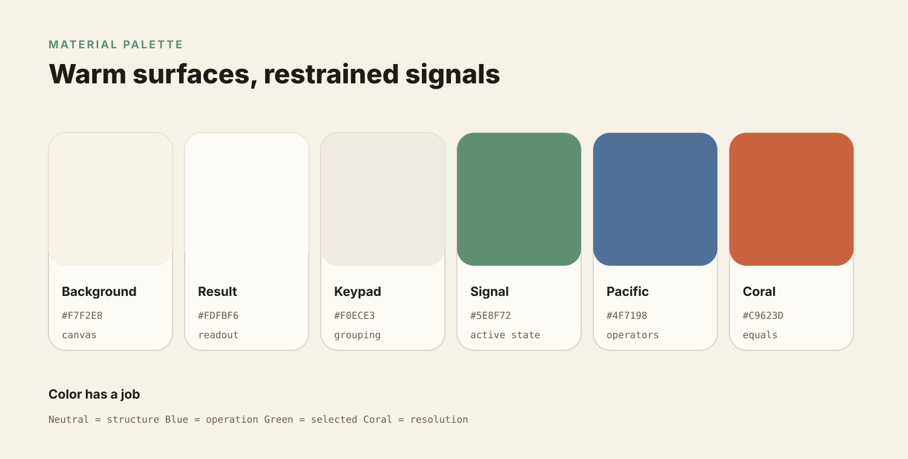

The palette is semantic:

| Role | Token | Value |
|---|---|---|
| Canvas | `background` | `#F7F2E8` |
| Result surface | `resultSurface` | `#FDFBF6` |
| Keypad grouping | `keypadPlate` | `#F0ECE3` |
| Primary text | `text` | `#1D1C18` |
| Operator | `pacificBlue` | `#4F7198` |
| Active state | `signalGreen` | `#5E8F72` |
| Final action | `warmOrange` | `#C9623D` |
| Secondary signal | `marigold` | `#D2A84B` |

Color never acts alone for the main state change. The active operator also changes border, shadow, label treatment, and its `selected` accessibility state.

---

## 5. Engineering

### Architecture

The architecture separates the things most likely to change for different reasons. UI components can be redesigned without rewriting arithmetic. Formatting can be tested without mounting React Native. Haptics can fail without interrupting a calculation. Tokens can adjust compact behavior across components.

The route layer is intentionally small. [`app/index.tsx`](../../app/index.tsx) renders one product screen, while [`app/_layout.tsx`](../../app/_layout.tsx) sets the gesture root, background, status bar, and headerless Expo Router stack.

### State machine

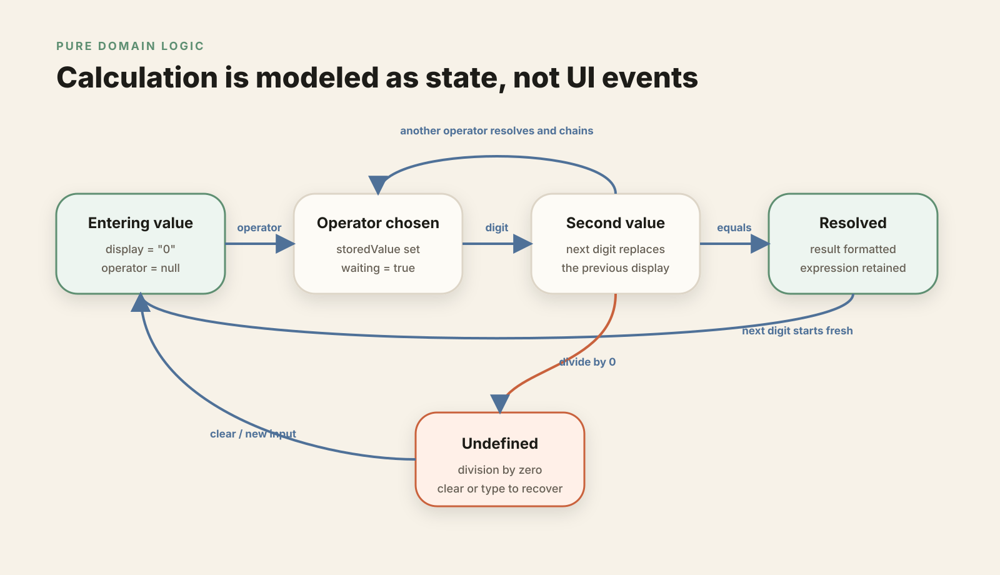

The first public implementation kept calculator transitions inside a hook. During release preparation, I extracted them into [`machine.ts`](../../src/logic/calculator/machine.ts), a pure TypeScript module. The hook now wraps those transitions for React instead of defining their behavior.

The state contains:

- `display`, the current visible value.
- `expression`, the readable operation context.
- `storedValue`, the left operand.
- `operator`, the pending operation.
- `waitingForOperand`, whether the next digit should replace the display.

Pure functions handle `inputDigit`, `inputDecimal`, `deleteDigit`, `clear`, `percent`, `chooseOperator`, and `equals`. This is small enough to read in one sitting, which is a feature. Calculator logic becomes hard to trust when state changes are distributed across button callbacks.

### Arithmetic and formatting

[`calculate.ts`](../../src/logic/calculator/calculate.ts) contains the four operators. [`format.ts`](../../src/logic/calculator/format.ts) owns input limits, operator symbols, parsing, expression values, normalized results, negative zero, division by zero, and exponential notation.

Keeping formatting separate matters because `0.1 + 0.2` should not expose raw floating-point noise, and values outside a practical display range need a stable fallback. The formatter rounds with `toPrecision(12)` before choosing standard or exponential output.

### Component organization

```text
app/
  _layout.tsx                 Expo Router and native shell
  index.tsx                   product route
src/
  components/calculator/     five visible UI components
  design-system/tokens/      color, layout, motion, shadow, spacing, type
  haptics/                    native feedback boundary
  logic/calculator/          arithmetic, formatting, state machine, hook, tests
```

The project is not large enough to justify a framework-heavy architecture. The boundaries are there because each one is useful, not because a diagram needed more boxes.

### Design tokens

Six token modules centralize visual behavior:

- `colors.ts` defines semantic surfaces and states.
- `layout.ts` defines breakpoints, key sizes, rail widths, input scaling, and text multipliers.
- `motion.ts` defines scale, depth, spring, and timing values.
- `shadows.ts` defines elevation by control role and state.
- `spacing.ts` defines spacing and radius scales.
- `typography.ts` defines weights, sizes, and line heights.

This made the redesign practical. The move from orange-led softness to the Macintosh Refined palette changed shared tokens and a few structural styles instead of scattering new hex values across the app.

### Accessibility strategy

The implementation includes:

- Button roles and descriptive labels for every calculator key.
- A selected state on the active operator.
- A text role and polite live region on the result.
- Decorative marks hidden from assistive technologies.
- Reduced Motion support for key and result animation.
- Touch targets of at least 50 points in compact mode and 54 points in standard mode.
- Limited font multipliers to protect a fixed calculator layout.

The release audit still calls for manual VoiceOver, largest Dynamic Type, Increase Contrast, and physical-device Reduced Motion checks. I would rather list those gaps than turn code inspection into a false claim of complete accessibility certification.

### Testing strategy

The test suite has 14 focused cases in one file. It checks:

- all four arithmetic operators;
- division by zero;
- rounding, negative zero, undefined, and exponential formatting;
- expression parsing and formatting;
- leading zero replacement and the ten-digit input cap;
- decimal de-duplication;
- deletion and reset behavior;
- full clear behavior;
- percentage conversion;
- equals for addition and subtraction;
- state-machine division by zero;
- chained operations;
- fresh input after equals.

At the time of this case-study build, `npm test` passed all 14 cases in 137 ms, `npm run typecheck` passed, and `npx expo install --check` reported that dependencies were up to date.

The current tests target domain behavior. They do not replace interaction tests, accessibility traversal, visual regression tests, or device QA. Those would be the next additions if the app grew beyond a focused v1.

### Build pipeline

The local quality gate is:

```bash
npm install
npm test
npm run typecheck
npx expo install --check
```

[`eas.json`](../../eas.json) requires EAS CLI 14 or newer, keeps app versioning local, defines an internal development client, and defines a production iOS device build. [`app.json`](../../app.json) contains the Expo project ID, owner, bundle identifier, build number, portrait orientation, and the `usesNonExemptEncryption: false` declaration.

The production build used:

```bash
eas build --platform ios --profile production
```

The first attempt reached Apple Developer authentication and stopped for a six-digit 2FA code. After the account owner completed authentication, EAS generated the signing credentials, completed the production build, and supplied the binary uploaded to App Store Connect and TestFlight.

### Git workflow

The product release sprint uses a linear six-commit sequence on `main`. Those commits are scoped around release outcomes: source release, redesign and test preparation, audit, export compliance, public assets, and blocker documentation. Later commits publish and correct this portfolio material.

This history is easy to review, but it has one weakness: the first public commit is already a large finished snapshot. A stronger future workflow would preserve discovery earlier, use smaller feature branches, and tag `v1.0.0` once the production App Store version is accepted. The current history proves the release sprint; it does not prove the full design timeline.

---

## 6. Debugging stories

These stories matter because the final screenshot hides the work. Evidence levels are stated for each one. The current source preserves the fix patterns, but some exact console logs and early screenshots were not committed.

### The 789 rendering bug

**Symptom.** The first numeric row, `7 8 9`, could disappear or clip while the utility row and lower keypad remained visible. That made the failure look like bad data even though the digit array was correct.

**Investigation.** The row was the first repeated numeric child beneath the utility controls, so it was also the first place where vertical compression became visible. The useful question was not "why are these three strings missing?" but "which container is allowed to shrink?" The labels, mapping keys, and handlers were present.

**Root cause.** The keypad combined flex growth, repeated rows, animated wrappers, explicit gaps, and a fixed operator rail. Under a constrained height, React Native could compress a row or its key wrapper. The 789 row exposed the layout problem first.

**Solution.** The final layout gives each row `flexShrink: 0`, gives each `CalcKey` shadow wrapper `flexShrink: 0`, and assigns explicit standard and compact key heights. Compact mode reduces every related dimension together rather than asking flexbox to invent a compromise.

**Lesson.** When a repeated item vanishes, verify layout measurement before rewriting the data loop. The data was fine. The available geometry was not.

**Evidence.** The final safeguards are visible in [`NumericIsland.tsx`](../../src/components/calculator/NumericIsland.tsx), [`CalcKey.tsx`](../../src/components/calculator/CalcKey.tsx), and the compact values in [`layout.ts`](../../src/design-system/tokens/layout.ts). The failing screenshot was not retained.

### The result shrink bug

**Symptom.** A long value forced the result to fit, then a later short result could appear smaller than expected or sit in a frame sized for the previous value. The feature designed to prevent overflow made the type feel unstable.

**Investigation.** The display mixed three systems: text auto-fit, animated scale for equals, and font sizes chosen for content length. Treating all three as one scaling problem made it difficult to know which layer owned the final size.

**Root cause.** Auto-fit is a safety behavior, not a typography system. If it alone decides the size inside an animated or recently remeasured frame, transitions between long and short strings can inherit awkward measurements.

**Solution.** [`ResultDisplay.tsx`](../../src/components/calculator/ResultDisplay.tsx) now computes a typography style from the current string on every display change. It distinguishes short values, medium values, long values, exponential notation, and `Undefined`. The result frame has a stable minimum height, tabular numbers prevent horizontal jitter, and auto-fit remains only as a final fallback. The equals animation scales a wrapper temporarily and always springs back to one.

**Lesson.** Responsive type needs deterministic states. Auto-fit is useful after those states are defined, not instead of them.

**Evidence.** The current `getResultTypography` function and stable frame are committed. No automated visual regression test currently covers the transition.

### The key alignment bug

**Symptom.** The zero key, decimal key, and operator rail could drift out of the column rhythm. Small width differences became obvious because calculator layouts are repetitive.

**Investigation.** Equal `flex: 1` columns work until one key spans two columns and a separate rail uses fixed width. The gap between columns must be included in the wide key's proportion.

**Root cause.** A naive `flex: 2` zero key accounts for two keys but not the internal gap. Arbitrary rail padding also changes its optical alignment even when its numeric width is correct.

**Solution.** The final zero key uses a tuned `2.02` flex ratio, rows share one gap token, the rail has explicit standard and compact widths, and rail padding is zero. The keypad plate gives the two regions one outer frame, which makes alignment easier to inspect.

**Lesson.** Repetition raises the standard for geometry. A two-point error that disappears in a card grid becomes the first thing a user sees on a keypad.

**Evidence.** See `zeroKeyFlex`, rail widths, and spacing tokens in [`layout.ts`](../../src/design-system/tokens/layout.ts), plus the row styles in [`NumericIsland.tsx`](../../src/components/calculator/NumericIsland.tsx).

### Simulator and device-size issues

**Symptom.** A layout tuned on a large simulator could crowd the display or keypad on a shorter or narrower iPhone. Safe areas and the status region changed the usable height.

**Investigation.** Scaling the whole screen would have reduced touch targets and weakened hierarchy. The better approach was to identify the dimensions that could compress safely.

**Root cause.** The original layout used one set of key, gap, rail, display, and padding values. Those values were individually valid but did not fit every supported viewport as a system.

**Solution.** `useWindowDimensions` activates compact mode below 700 points of height or 360 points of width. Compact mode reduces key height, key minimum height, rail width, gaps, plate padding, display height, and screen padding. `SafeAreaView` keeps content clear of system UI.

**Lesson.** Responsive mobile design is coordinated constraint management. Shrinking one component usually moves the problem somewhere else.

**Status.** Simulator assets were generated at 1206 by 2622 pixels, and the code has explicit compact behavior. The release audit still requires physical-iPhone testing, landscape is out of scope because v1 is portrait-only, and largest Dynamic Type needs manual review.

### Expo dependency and build problems

**Symptom.** Expo projects can compile locally while package versions are outside the SDK's supported set. That turns a UI problem into a build problem late in the release.

**Investigation.** The repository uses Expo's compatibility check rather than assuming the lockfile is sufficient. Dependency warnings were also reviewed separately from app-source security.

**Root cause.** Expo SDK packages move as a coordinated set. Installing the latest version of one dependency can produce a technically valid npm tree that is not the supported Expo combination.

**Solution.** The project locks dependencies in `package-lock.json`, uses Expo 54-compatible package versions, and includes `npx expo install --check` in the release gate. The current check passes.

**Lesson.** A green TypeScript build does not prove native dependency compatibility.

### Node version issues

**Symptom.** Development commands behaved differently across Node environments during setup.

**Investigation.** The useful separation was between application failures and toolchain failures. Tests and type checking exercise the project; Node and npm versions affect the CLI running those tasks.

**Root cause.** The repository does not contain `.nvmrc`, `.node-version`, or a `package.json` engine field, so the runtime is not pinned. The workstation used to verify this case study currently reports Node `25.9.0` and npm `11.12.1`, but that is machine state, not a repository guarantee.

**Solution so far.** The lockfile and Expo compatibility check stabilize packages, and the current local tests pass. Runtime pinning remains a documented improvement because this portfolio-only task does not modify the app or its build configuration.

**Lesson.** If an exact version matters, commit it. A version mentioned in a terminal session is not reproducible documentation.

**Evidence limit.** The original Node error text and exact failing version were not retained. I am not reconstructing a command or stack trace that the repository cannot support.

### EAS configuration and Apple credentials

**Symptom.** A production iOS build could not progress through signing, even after the Expo project and production profile were configured.

**Investigation.** The app configuration, bundle identifier, EAS project link, build target, export-compliance declaration, and account ownership were checked separately. The build reached Apple login, which showed the project configuration was being read.

**Root cause.** iOS distribution requires a certificate and provisioning profile tied to an Apple Developer account. EAS needed the account owner's six-digit 2FA code to create or validate those credentials.

**Solution.** The repository records the original blocker in [`testflight-readiness.md`](../testflight-readiness.md). There was no responsible code-only bypass. The account owner completed 2FA, EAS created or validated the signing assets, the build completed, and the binary was uploaded to App Store Connect.

**Lesson.** Shipping includes identity, authorization, and platform policy. Some blockers should be documented and handed to the account owner, not "fixed" in source.

**Status.** Resolved. Signing and the production build completed, and Not Plain Calc is available as a public TestFlight beta.

---

## 7. Product shipping

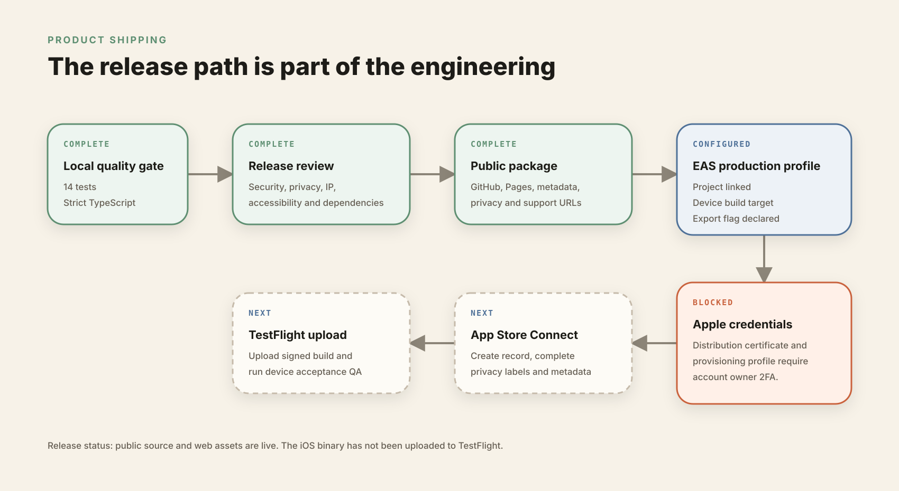

### GitHub publication

The project is published at [github.com/Pitta150507/not-plain-calc](https://github.com/Pitta150507/not-plain-calc). The repository includes source, tests, release documentation, screenshots, store metadata, and public pages. No secrets or credentials are committed.

### Release preparation

Release preparation covered more than an icon and version number:

- App name, slug, bundle identifier, version, and build number were checked.
- The production icon was installed and tested at reduced sizes.
- Five App Store portrait frames were generated at 1290 by 2796 pixels.
- Marketing, support, and privacy pages were published from `/docs` through GitHub Pages.
- App Store description, subtitle, keywords, category, URLs, disclaimer, and screenshot order were drafted.
- The iOS export-compliance flag was declared.

### Security review

The release audit searched app source for secrets, environment files, network APIs, analytics, tracking, backend SDKs, databases, and dynamic code execution. It found none. The app-source security risk was rated low.

`npm audit` reported 13 moderate advisories in Expo and tooling dependency chains at the time of the release audit. The available automated fix required broad major-version upgrades. I did not use `npm audit fix --force` because that would change the platform under a release candidate without a dedicated migration and regression pass.

This is a useful distinction: the app does not send data or execute remote code, but its development toolchain still has dependency maintenance work.

### Privacy review

The privacy position is simple enough to verify in code:

- no account;
- no backend or database;
- no network request code in app source;
- no analytics, ads, or tracking;
- no personal-data collection;
- no calculator input leaves the device.

The intended App Store privacy classification is "Data Not Collected." A public privacy policy is live at [pitta150507.github.io/not-plain-calc/privacy.html](https://pitta150507.github.io/not-plain-calc/privacy.html).

### Legal and IP review

The review considered the product name, public wording, interface references, and icon. The final assets avoid Apple logos, Macintosh hardware, historical system artwork, and copied calculator screens. Public marketing uses an independence disclaimer.

This was a developer-level review, not legal advice. A human legal review remains sensible before a public App Store submission if the case study's Macintosh discussion becomes a central marketing claim.

### EAS build

EAS is linked to project `8811cf3a-7905-45b4-8f00-302b6b96783b`. The production profile targets a physical iOS build rather than a simulator. The local app version remains the source of truth.

The first build attempt stopped at Apple Developer authentication. The account owner later completed 2FA, EAS finished the signed production build, and the artifact was uploaded to App Store Connect. The build duration was not retained, so it is reported as unknown rather than estimated.

### App Store Connect and TestFlight

The App Store Connect record exists, the signed binary was uploaded, and TestFlight distributes it as a public beta. Reaching this point required completing Apple Developer 2FA, creating the signing assets, generating the production build, uploading it to App Store Connect, and enabling public beta distribution.

The remaining work belongs to the production App Store release: gather beta feedback, complete the final physical-device and accessibility pass, confirm store metadata and privacy answers, and submit the production version for App Review.

---

## 8. Metrics

Metrics were measured from the `main` branch and release records through June 30, 2026. Source-line counts include blank lines and comments because they use `wc -l`; they exclude `package-lock.json`, images, HTML, CSS, and Markdown.

| Metric | Value | Method or note |
|---|---:|---|
| TypeScript and TSX lines | 1,592 | All files under `app/` and `src/` |
| Production TypeScript and TSX | 1,446 | Excludes `__tests__` |
| Test code | 146 lines | One focused state-machine test file |
| Calculator UI components | 5 | Screen, result, numeric island, operator rail, key |
| Design-token modules | 6 | Color, layout, motion, shadow, spacing, typography |
| Unit tests | 14 | All passing |
| Test execution | 137 ms | Local Vitest run during case-study verification |
| Product release commits | 6 | Documented June 8 to June 9 release sprint, before portfolio publication commits |
| Distribution | 1 public beta | Version `1.0.0` on TestFlight; no production App Store release and no Git tag |
| Tracked files before this case study | 75 | `git ls-files` before portfolio assets were added |
| Tracked repository payload | 11,585,428 bytes | Before this case-study folder |
| Production build time | Not recorded | EAS completed the signed artifact, but the duration was not retained |
| Documented development time | 32 h 29 min | First to last public release commit, across 2 calendar days |
| UI stages preserved in Git | 2 | First public snapshot and Macintosh Refined |
| Icon exploration | 3 archived directions, 5 final crop candidates | Candidate E became the production icon |
| App Store screenshots | 5 | Each 1290 by 2796 pixels |
| Data collected | 0 categories | Offline app, no analytics or backend |

The line count is context, not a quality score. The more useful numbers are the 14 behavior tests, five reusable components, six token modules, and a completed path to public beta distribution.

---

## 9. Lessons learned

### What worked

Keeping the calculator mental model familiar gave the design room to become distinctive elsewhere. I did not need to explain what blue operator keys or a coral equals key did because their positions and labels remained conventional.

Extracting the state machine was the best engineering decision in the release sprint. It turned button behavior into pure functions and made awkward sequences cheap to test. It also made visual iteration safer because the UI no longer owned arithmetic rules.

The token system paid off even in a small app. A calculator has many repeated surfaces, gaps, shadows, and type states. Centralizing them made inconsistency visible and made the redesign faster.

The final icon process also worked. Testing product-derived crops at 60, 120, and 180 pixels exposed decorative details that did not survive. Candidate E is simpler than the rejected keypad icon and more specific than the abstract icon.

### What failed

The early visual direction was polished but generic. Warm gradients, oversized rounded keys, and orange emphasis produced a pleasant screen without a clear product idea.

The random keypad icon tried to communicate "calculator" by including calculator symbols. Duplicate and invented controls made it feel less trustworthy. It was a good-looking wrong answer.

The Git history began too late. The first commit already contained more than ten thousand inserted lines because it included the lockfile and a largely complete app. That makes the release auditable but weakens the evidence for early exploration. In a future portfolio project, I would commit working prototypes, screenshots, and design decisions as they happen.

The release process also exposed an operational mistake: toolchain runtime versions were not pinned. The lockfile protects dependencies, but it does not tell a new machine which Node version to use.

### What surprised me

The hardest bugs were visual side effects of correct data. The 789 row existed. The result value was correct. The key widths were almost correct. A calculator makes those small geometry failures impossible to ignore.

I was also surprised by how much release work happens after the app feels finished. Privacy copy, support URLs, screenshots, export compliance, dependency review, signing, provisioning, App Store metadata, and physical-device QA are all part of the product.

The Apple 2FA blocker was frustrating, but documenting it improved the project. It forced a clear boundary between work completed in the repository and work that required account-owner authority. Once the owner completed authentication, the same pipeline produced the build now distributed through public TestFlight.

### What I would do differently

- Start Git history before the first visual prototype.
- Save screenshots for every meaningful UI direction, including failures.
- Record debugging notes with device, viewport, reproduction steps, and exact console output.
- Pin Node with an `.nvmrc` or `.node-version` and add an engine range.
- Add visual regression tests for the keypad and result-length states.
- Add interaction tests for accessibility roles and selected state.
- Run physical-device checks earlier, not only at release readiness.
- Create an App Store Connect record before the final build day so credentials and metadata do not become one combined blocker.
- Tag the source release when the corresponding binary is accepted.

### How the project changed my view of software design

I used to think a small app reduced the need for architecture. This project taught me the opposite. A small product has nowhere to hide a weak decision, so clean boundaries matter more, not less.

It also changed how I think about visual identity. Identity is not the number of custom elements on screen. It is the consistency between behavior, layout, material, type, motion, and the icon. The final Not Plain Calc icon works because it is a compressed piece of the interface, not a separate branding exercise.

Most of all, I learned to treat an unfinished shipping step as information rather than hide it. The repository captured the 2FA blocker when it was real, then the release moved forward: Apple authentication and signing completed, App Store Connect received the build, and a public TestFlight beta went live. Production App Store release and expanded accessibility QA remain separate work.

---

## 10. Portfolio summary

### Not Plain Calc &mdash; Designing and Shipping a Modern Macintosh-Inspired Calculator

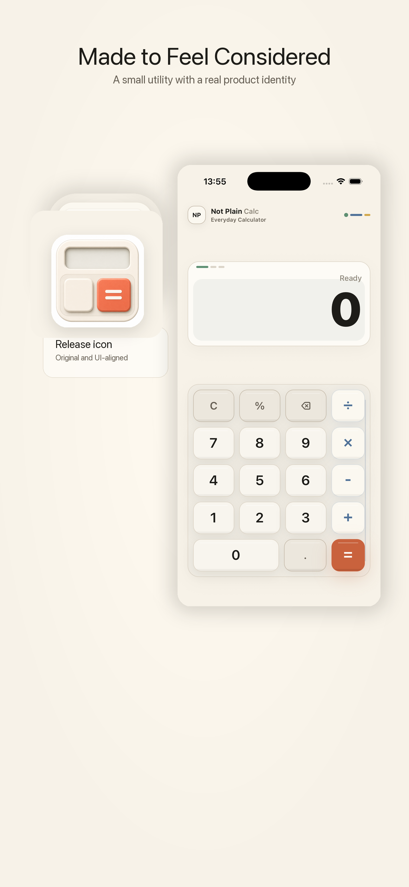

### Snapshot

| | |
|---|---|
| Role | Product Designer, iOS Developer, Software Engineer |
| Duration | Documented release sprint: June 8 to June 9, 2026, 32 h 29 min |
| Product | Offline, iPhone-first everyday calculator |
| Technologies | Expo 54, React Native 0.81, React 19, TypeScript 5.9, Reanimated, Expo Haptics, Vitest, EAS |
| GitHub | [github.com/Pitta150507/not-plain-calc](https://github.com/Pitta150507/not-plain-calc) |
| TestFlight | Public beta live. Signed build uploaded through App Store Connect. |

### Challenge

Calculator apps are familiar enough to disappear. The design challenge was to create a recognizable product without changing the interaction model users already understand.

### Response

I designed Macintosh Refined, an original interface informed by early personal-computer principles: clear grouping, visible controls, warm materials, and approachable precision. The final screen uses an inset result well, tactile keys, a blue operator rail, green active state, and coral equals action. The app icon is derived from the same product geometry.

### Engineering

I separated the Expo Router shell, five calculator components, native haptics, six token modules, and a pure TypeScript state machine. Fourteen unit tests cover arithmetic, formatting, input limits, chained operations, division by zero, and post-equals behavior. Strict type checking and Expo dependency validation pass.

### Shipping work

I published the repository and GitHub Pages, generated five App Store screenshots, wrote the privacy and support pages, prepared App Store metadata, reviewed security and dependency risk, documented the no-data-collection position, assessed Apple-related IP risk, configured EAS, completed signing, uploaded the build to App Store Connect, and opened the public TestFlight beta.

### Key achievements

- Turned a standard calculator into a coherent product without adding feature clutter.
- Reworked the initial visual direction into a product-specific material system.
- Converted UI-bound calculator behavior into a tested state machine.
- Solved layout compression, adaptive result type, and keypad alignment issues.
- Built a product-derived icon through five small-size crop tests.
- Resolved the Apple credential blocker and shipped a public TestFlight beta through App Store Connect.

### Final screen set

| Calculation context | Tactile controls | Release package |
|---|---|---|
| 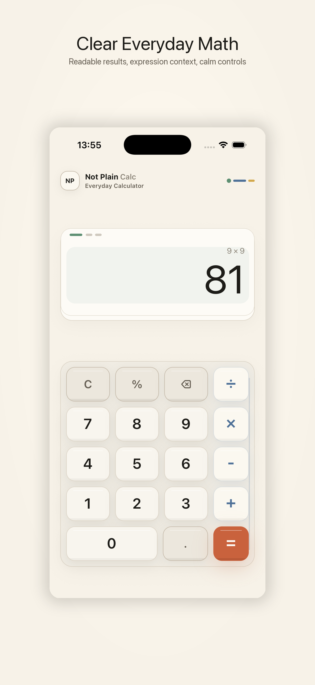 | 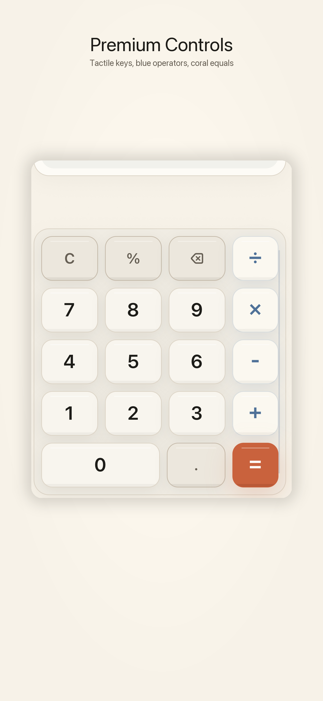 | 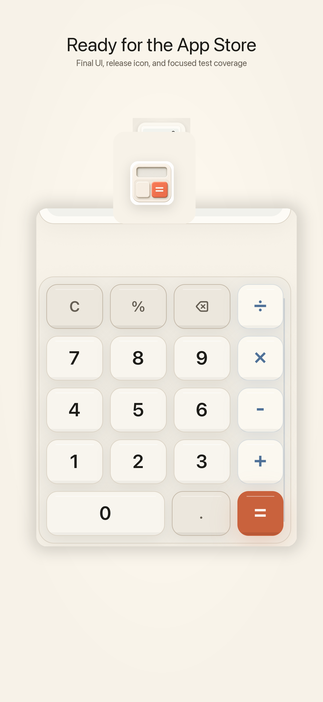 |

### Result

Not Plain Calc v1.0 is a tested, public, offline calculator beta with a complete visual identity and live TestFlight distribution. The project demonstrates product design, React Native engineering, debugging, accessibility thinking, release preparation, and the operational work required to move from a finished app to a publicly testable iOS product.

---

## Asset index and provenance

All visuals in this folder come from the repository's own source or existing product captures. No third-party Apple artwork is included.

| Folder | Contents |
|---|---|
| [`screenshots/`](screenshots/) | Five 1290 by 2796 App Store frames, two raw 1206 by 2622 product captures, and one keypad detail. |
| [`diagrams/`](diagrams/) | Original SVG architecture, state-machine, timeline, shipping, and design-evolution graphics created for this case study. |
| [`assets/`](assets/) | Original icon directions, final icon candidates, color board, and spacing/type board. |

Status and metrics were verified against `main` on June 30, 2026. The product source and UI were not modified while creating or correcting this case study.
